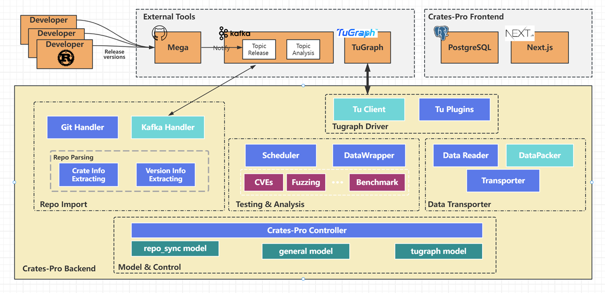
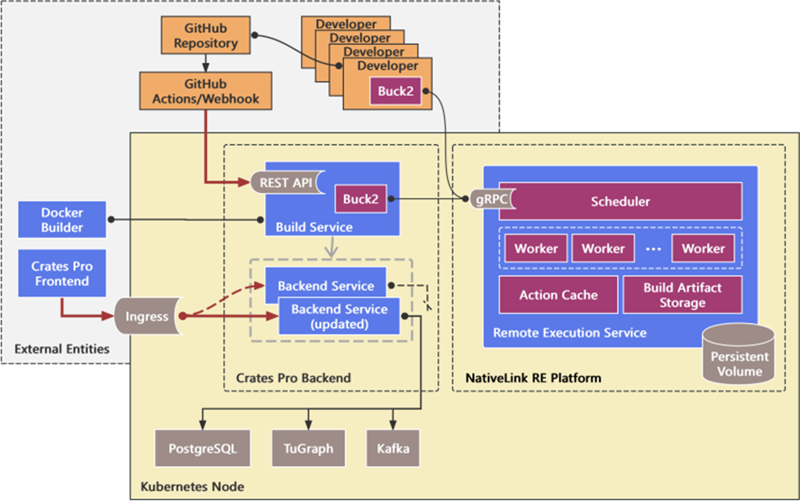

<!--

**Here are some ideas to get you started:**

🙋‍♀️ A short introduction - what is your organization all about?
🌈 Contribution guidelines - how can the community get involved?
👩‍💻 Useful resources - where can the community find your docs? Is there anything else the community should know?
🍿 Fun facts - what does your team eat for breakfast?
🧙 Remember, you can do mighty things with the power of [Markdown](https://docs.github.com/github/writing-on-github/getting-started-with-writing-and-formatting-on-github/basic-writing-and-formatting-syntax)
-->
## CratesPro - A Rust Crate Analysis and Recommendation Platform
CratesPro is a sophisticated platform designed to analyze and evaluate Rust crates. By leveraging AI-driven models and multidimensional analytics, CratesPro provides developers with comprehensive insights and intelligent recommendations about crates, helping to identify potential vulnerabilities, optimize dependencies, and enhance security and efficiency in Rust development. The platform tracks dependencies, monitors the propagation of vulnerabilities, and provides real-time analysis of new crate versions. 

<!--
Below is the overview of CratesPro.

  

And below is the build system.

  

--->

### Features
#### AI-Powered Multi-Dimensional Analysis
CratesPro leverages advanced AI models to provide in-depth, multi-dimensional analysis of Rust crates. By analyzing a variety of data points—including code structure, dependencies, and historical vulnerability patterns—the platform offers intelligent recommendations to optimize crates, enhance security, and reduce the risk of bugs or inefficiencies in your code.

#### Vulnerability Detection and Risk Assessment
CratesPro automatically detects potential vulnerabilities in the crates, including logic flaws, security risks, and performance bottlenecks. Using intelligent pattern recognition, it scans crate code and their dependencies to identify possible threats or weaknesses. These findings are presented with suggested fixes and recommendations.

#### CVE Tracking and Vulnerability Propagation
CratesPro tracks CVE (Common Vulnerabilities and Exposures) related to Rust crates and their dependencies. The platform monitors crate versions and their updates, correlating them with known CVE databases to provide real-time updates on newly discovered vulnerabilities. This helps developers stay informed about potential threats to their projects and take proactive measures.

#### User-Uploaded Crates for Comprehensive Analysis
CratesPro supports users who wish to upload their custom crates for comprehensive analysis. After uploading, CratesPro performs a full evaluation of the crate, analyzing dependencies, potential vulnerabilities, and even compatibility with other crates in the Rust ecosystem. This feature empowers developers to ensure the security and reliability of their own creations before publication.

#### Dependency Tracking and Visualization
CratesPro offers detailed tracking of crate dependencies, visualizing the relationships between crates and how vulnerabilities propagate across them. By modeling dependencies and interactions, developers can see how a vulnerability in one crate may affect others in the ecosystem, offering a clearer understanding of potential risks.
